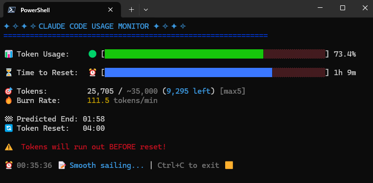

> [!NOTE]
> [ccusage](https://ccusage.ryoppippi.com/) introduced the same feature in v15, so this tool is not necessary.  
> Try it with the following command:
> ```sh
> npx ccusage blocks --live
> ```


# Claude Code Usage Monitor - TypeScript Port

A TypeScript port of
[Claude-Code-Usage-Monitor](https://github.com/Maciek-roboblog/Claude-Code-Usage-Monitor).
This project is for my personal use and is unofficial, so I recommend using the
original project.

## 

## ⚡ Quick Start

For immediate testing:

```sh
# Pre-requisite: Install ccusage CLI tool
npm install -g ccusage

git clone https://github.com/ryuapp/ccusage-monitor.git
cd ccusage-monitor
npm run start
```

## 📖 Usage

### Basic Usage

```sh
# Default (Pro plan - 7,000 tokens)
npm run start

# Exit the monitor
# Press Ctrl+C to gracefully exit
```

### Configuration Options

#### Specify Your Plan

```sh
# Pro plan (~7,000 tokens) - Default
npm run start -- --plan pro

# Max5 plan (~35,000 tokens)
npm run start -- --plan max5

# Max20 plan (~140,000 tokens)
npm run start -- --plan max20

# Auto-detect from highest previous session
npm run start -- --plan custom_max
```

#### Custom Reset Times

```sh
# Reset at 3 AM
npm run start -- --reset-hour 3

# Reset at 10 PM
npm run start -- --reset-hour 22
```

#### Timezone Configuration

```sh
# Use US Eastern Time
npm run start -- --timezone US/Eastern

# Use Tokyo time
npm run start -- --timezone Asia/Tokyo

# Use UTC
npm run start -- --timezone UTC

# Use London time
npm run start -- --timezone Europe/London
```

### Available Plans

| Plan           | Token Limit | Best For                            |
| -------------- | ----------- | ----------------------------------- |
| **pro**        | ~7,000      | Light usage, testing (default)      |
| **max5**       | ~35,000     | Regular development                 |
| **max20**      | ~140,000    | Heavy usage, large projects         |
| **custom_max** | Auto-detect | Uses highest from previous sessions |

## 📝 License

[MIT License](LICENSE)

## 🙏 Prior art

- [Claude-Code-Usage-Monitor](https://github.com/Maciek-roboblog/Claude-Code-Usage-Monitor)
  by [Maciej](https://github.com/Maciek-roboblog)
  - Original Python implementation that inspired this TypeScript port

- [ccusage](https://github.com/ryoppippi/ccusage) by
  [@ryoppippi](https://github.com/ryoppippi)
  - A CLI tool for analyzing Claude Code usage from local JSONL files
